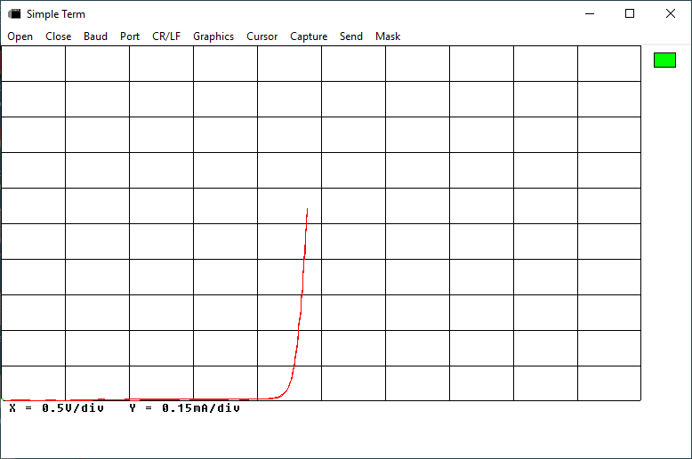

# Simple-Graphing-Terminal

A simple serial terminal for Windows(R) computers. Useful for Arduino text display and data graphing.

The source code is written and compiled using the Lazarus IDE.

How to use the simple.exe application is presented in simple_term_use.pdf.

Place the folder Crt into your Arduino/Libraries folder if you want to simplify graphing using simple.exe.

A low part count curve tracer circuit and sketch are provided in the ct_project folder.

